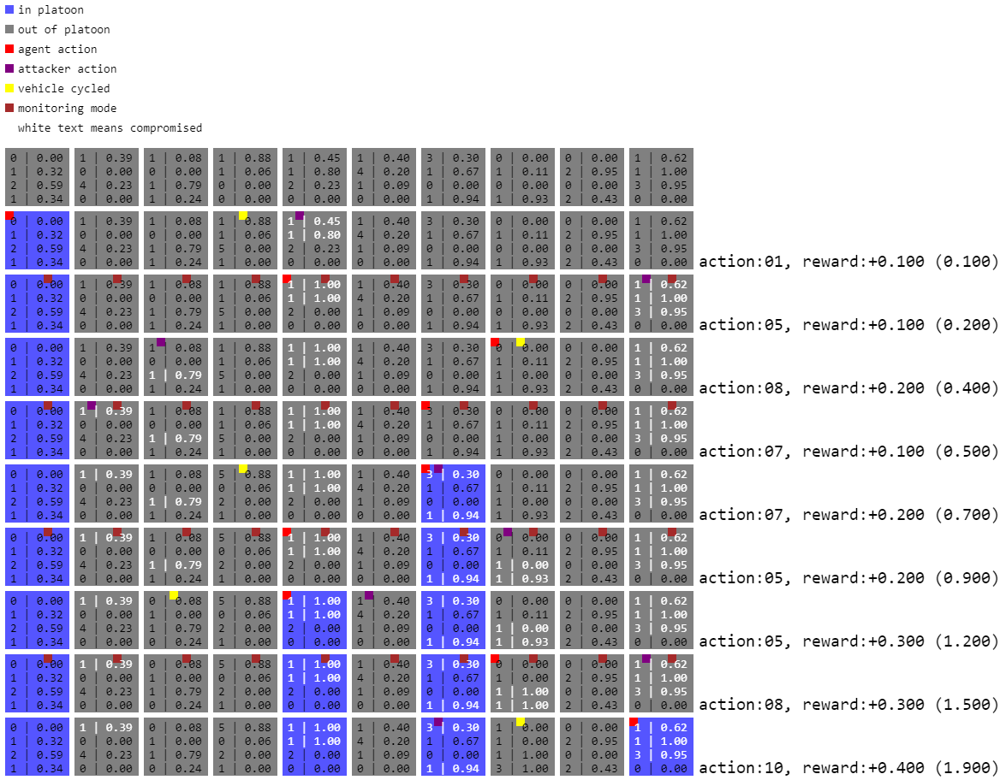

# Vehicular-Game-Theory

Code for my thesis involving autonomous vehicle security using game theory and reinforcement learning.

## Files of interest

- [minimax game.ipynb](./minimax%20game.ipynb) - Minimax game implementation and solver
- [platoonenv.py](./platoonenv.py) - Environment for the reinforcement learning models, Platoon-v6 is what you want
- [training.ipynb](./training.ipynb) - Training of the reinforcement learning models
- [comparison.ipynb](./comparison.ipynb) - Comparison of the reinforcement learning policies

Anything in the [./old/](./old) folder is likely outdated, but might give insight into the development process.

## Responses from the Ray RLLib Slack regarding my PPO agent not learning

Ensuring the step-wise rewards are between -1 and 1 was very effective at improving the learning.
Here's the full response from the slack for more info:

> 1. I personally would not use curiosity exploration until after I got a baseline version working first.
> 2. Does your observation include information about which row it is deciding an action for. You are not using framestacking or an rnn policy in your config. A pure feedforward policy could not learn to keep track of that information on its own.
> 3. You want to keep your rewards smaller preferably between 0 and 1. Also I have found that I get much better results it I return an instantaneous reward rather than cumulative on each step. So for example +/- for the square that was just turned on. Then at the end you can supply a terminal reward for the overall score. The reason is because targrt values will based on the return which will be a discounted sum of all the rewards in that episode. That adds a lot of extra counting of rewards and it makes it harder to distinguish good actions from bad ones (credit assignment).
> 4. Rllib's implementation of value clipping will Clio if the values loss is greater than 10. I would bet, given your rewards, that almost all of your experience steps are bring clipped. When a step is clipped, it will not be learned on. You can set the vf_clip to float("inf") to disable and see if that makes a difference. Whatcha or for Nan's during training if you do that though. (edited) 